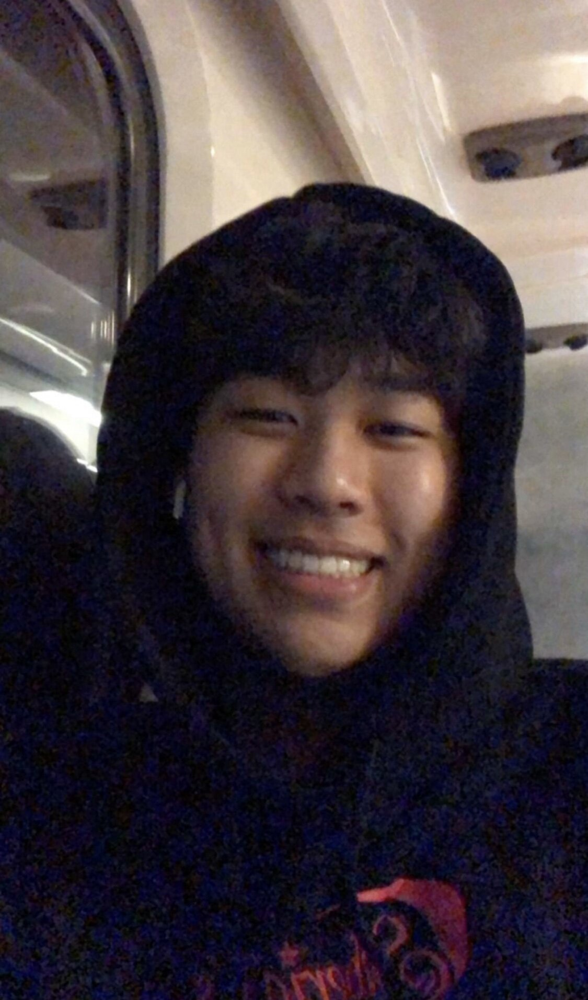

# Welcome to my CSE110 GitHub page!



## One of my favorite quotes:
> "Youth is wasted on the young" -Oscar Wilde

As a young kid, I always remember watching my dad work on the **command line**. From this, my curiosity for programming truly grew.
I remember learning and using basic internet protocol commands like:
```
ipconfig 
ipconfig /renew
ipconfig /release
ping -t
```
to diagnose any internet or connection issues I had. Now that I am a little older, I'm more interested in cybersecurity technologies, 
however, I hope my passion for programming and the knowledge I'll gain from *this* class can propel me into my dream career. 

Currently, some of my hobbies include [snowboarding](https://www.youtube.com/watch?v=V1tjmPn12v8) in the winter, and bowling in the summer. 

A [picture](/add-read-me/meanddadpic.jpg) of me and my dad.

### Some things I look forward to doing in the next year
- Graduate!
- Travel to Korea
- Start my career

### My top 3 favorite song artists
1. Mac Miller
2. Earl Sweatshirt
3. Still Woozy

### My current goals
- [ ] Graduate with over a 3.5 GPA
- [X] Become more fluent in Korean
- [ ] Land a job


